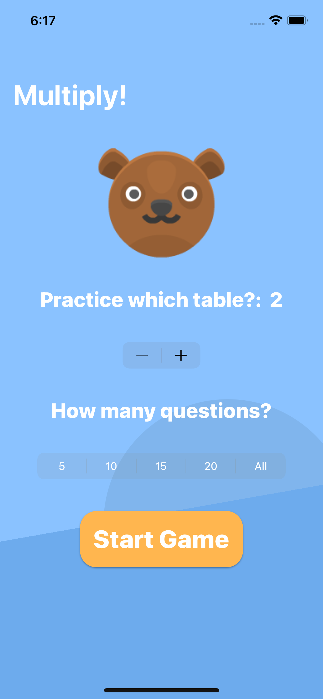
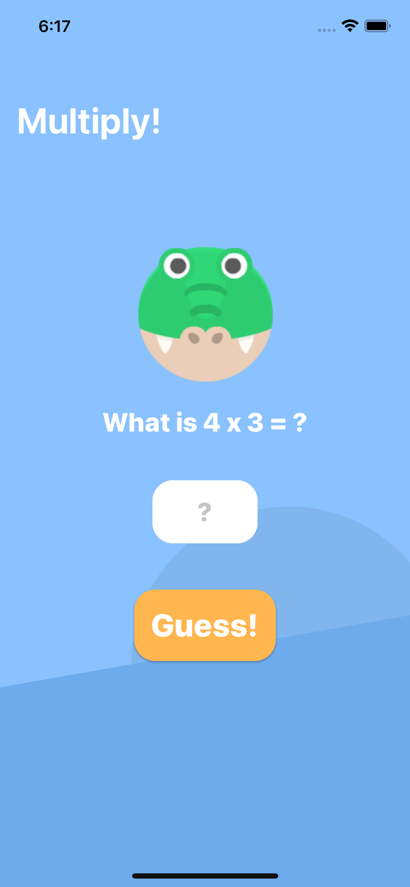
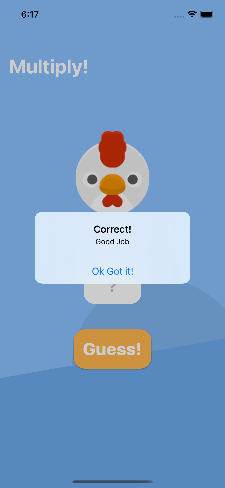
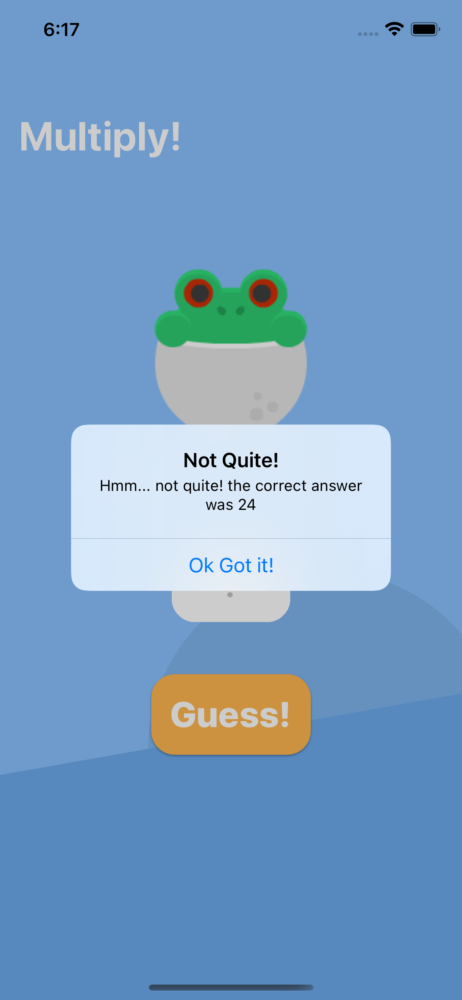
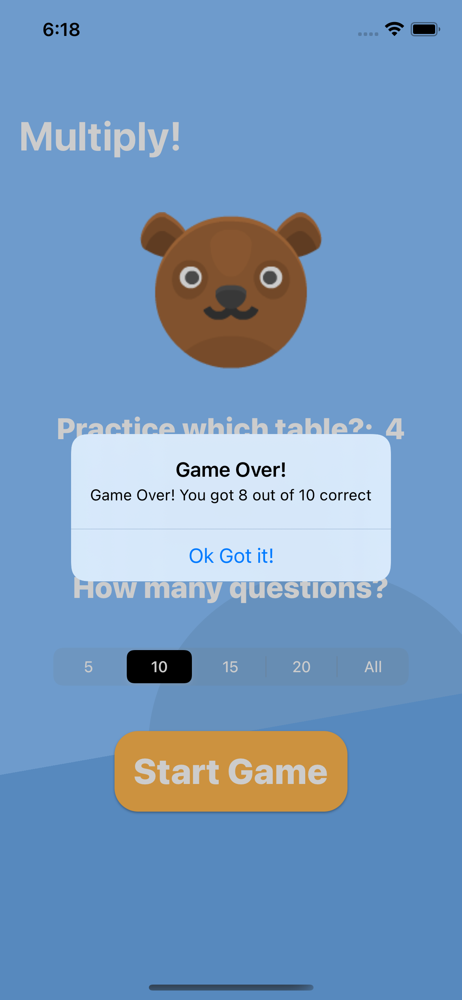

# multiply-game
An edutainment app that allows kids and children to practice their multiplication tables

Choose between various number of questions and numbers to practice multiplication tables on.

This project focuses on a combination of SwiftUI elements such as:
`Picker`, `Stepper`, Animations, `.alert`, multiple views and `State`

* Choose which number you wish to practice your multiplication on.
* Choose how many questions you wish to answer.

### Screenshots:
* Home screen (settings) and Quiz Screens
 

* Correct and Incorrect guesses
 

* Results alert

